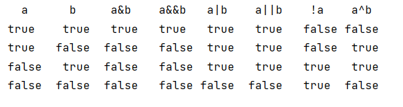
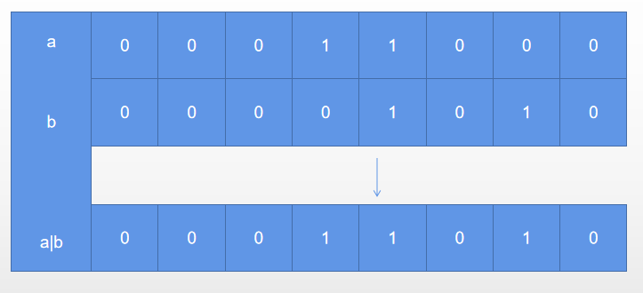

## 快速复习

### markdown
[markdown](https://www.markdownguide.org/cheat-sheet/)
基础命令网址

### 第一个 java 程序
```public class test{
    public static void main(String[] args) {test
        short s=5;
        //s=s-3;
        char c='d';
        int i=5;
        float f=3.14F;
        double result=c+i+f;
    }
}
```
## 逻辑运算符
ab不同情况下运算对应的结果<p>


## 位运算符
a|b<p>


