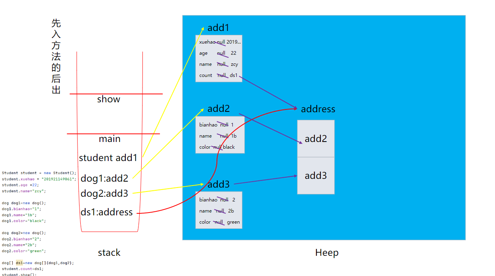

### 多个方法运行的过程

### 新增了一维数组相关引用方法（MyArrays.?）
<ol>
<li>min(x)</li>
<li>sum(x)</li>
<li>arage(x)</li>
<li>bianlishuzu(x)</li>
<li>shuzufanzhuan(x)</li>
<li> fuzhishuzu(x,x)</li>
<li> shuzupaixu(x)</li>
<li>chazhao(x)</li>
</ol> 